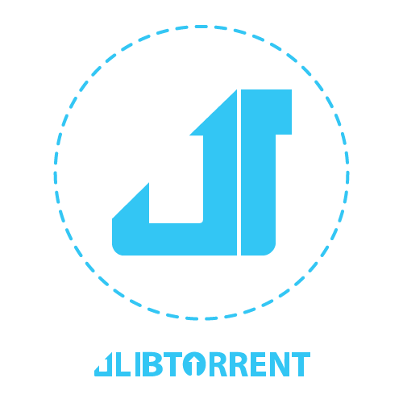

frostwire-jlibtorrent
=====================


A swig Java interface for libtorrent by the makers of FrostWire.

Develop libtorrent based apps with the joy of coding in Java.

Using
========

Download [the latest JAR](https://search.maven.org/remote_content?g=com.frostwire&a=jlibtorrent&v=LATEST) or get the dependency via Maven:
```xml
<dependency>
  <groupId>com.frostwire</groupId>
  <artifactId>jlibtorrent</artifactId>
  <version>1.1.0.19</version>
</dependency>
```
or Gradle:
```groovy
compile 'com.frostwire:jlibtorrent:1.1.0.19'
```

Note that there are multiple version of jlibtorrent for different platforms: `jlibtorrent`, `jlibtorrent-windows`, `jlibtorrent-linux`, `jlibtorrent-macosx` and `jlibtorrent-android-<arch>`. These are all different artifacts.

Here's a simple example of how to create a .torrent downloader using **frostwire-jlibtorrent**.

```java
public final class DownloadTorrent {

    public static void main(String[] args) throws Throwable {

        // comment this line for a real application
        args = new String[]{"/Users/aldenml/Downloads/Kellee_Maize_The_5th_Element_FrostClick_FrostWire_MP3_April_14_2014.torrent"};

        File torrentFile = new File(args[0]);

        System.out.println("Using libtorrent version: " + LibTorrent.version());

        final Session s = new Session();

        final TorrentHandle th = s.addTorrent(torrentFile, torrentFile.getParentFile());

        final CountDownLatch signal = new CountDownLatch(1);

        s.addListener(new TorrentAlertAdapter(th) {
            @Override
            public void onBlockFinished(BlockFinishedAlert alert) {
                int p = (int) (th.getStatus().getProgress() * 100);
                System.out.println("Progress: " + p);
            }

            @Override
            public void onTorrentFinished(TorrentFinishedAlert alert) {
                System.out.print("Torrent finished");
                signal.countDown();
            }
        });

        signal.await();
    }
}
```

=======
frostwire-jlibtorrent is currently compatible with libtorrent-rasterbar-1.0.2

Building
========

** Mingw-w32 build flags **

binutils:
--target=i686-w64-mingw32 --disable-multilib --with-sysroot=/home/user1/Development/toolchains/windows-x86 --prefix=/home/user1/Development/toolchains/windows-x86

--target=x86_64-w64-mingw32 --disable-multilib --with-sysroot=/home/user1/Development/toolchains/windows-x86_64 --prefix=/home/user1/Development/toolchains/windows-x86_64

mingw-w64-headers:
--build=i686-w64-mingw32 --host=i686-w64-mingw32 --prefix=/home/user1/Development/toolchains/windows-x86/i686-w64-mingw32

--build=x86_64-w64-mingw32 --host=x86_64-w64-mingw32 --prefix=/home/user1/Development/toolchains/windows-x86_64/x86_64-w64-mingw32

gcc:
--target=i686-w64-mingw32 --disable-multilib --with-sysroot=/home/user1/Development/toolchains/windows-x86 --prefix=/home/user1/Development/toolchains/windows-x86

--target=x86_64-w64-mingw32 --disable-multilib --with-sysroot=/home/user1/Development/toolchains/windows-x86_64 --prefix=/home/user1/Development/toolchains/windows-x86_64

mingw-w64-crt:
--host=i686-w64-mingw32 --with-sysroot=/home/user1/Development/toolchains/windows-x86/i686-w64-mingw32 --prefix=/home/user1/Development/toolchains/windows-x86/i686-w64-mingw32

--host=x86_64-w64-mingw32 -with-sysroot=/home/user1/Development/toolchains/windows-x86_64/x86_64-w64-mingw32 --prefix=/home/user1/Development/toolchains/windows-x86_64/x86_64-w64-mingw32

NodeJs JLibTorrent Module (alpha)
======
We have recently added support for a NodeJS binary module so you can now have all the power of libtorrent in Javascript/Node.

*Help Wanted:* At the moment we can only do simple things, like creating torrents and opening torrents, but nothing related to an actual torrenting session is still available, we need to figure out how to add a thread to process libtorrent alerts and then invoke the necessary callbacks for these alerts.

For now it builds, it can be imported in node and you can do simple things.

```bash
MBP:swig aldenml$ node
> var jlib = require("./build/Release/jlibtorrent");
undefined
> var s = new jlib.session()
undefined
> var ti = new jlib.torrent_info("/Users/aldenml/Downloads/Lisa_Richards_Beating_of_the_Sun_FrostWire_MP3_Nov_09_2015.torrent");
undefined
> ti
torrent_info {}
> ti.name()
'Lisa_Richards_Beating_of_the_Sun_FrostWire_MP3_Nov_09_2015'
>
```

[Here is an example of how to create a simple .torrent](https://gist.github.com/gubatron/afc811c5d3c9ff99a860) using the low level libtorrent API already available in Javascript/Node.

If you want to build the NodeJS module, you will need to install [node-gyp](https://github.com/nodejs/node-gyp)
```
npm install -g node-gyp
```

then from the `swig/` folder you can build the NodeJS jlibtorrent module with
```
node-gyp build
```

after the build is done, you can test by going to the `swig/build/Release` folder and issuing:
```bash
$ node -e "var jlibtorrent = require('./jlibtorrent'); console.log(jlibtorrent.LIBTORRENT_VERSION);"
1.1.0.0
```


**JLibTorrent Build Requirements**

export BOOST_ROOT=/<path>/boost_1_58_0
export LIBTORRENT_ROOT=/<path>/libtorrent
export JDK_ROOT=<path>
export NDK_ROOT=<path>
Only for Windows and Android
export OPENSSL_ROOT=<path>/openssl-1.0.2c

OpenSSL

For android, read this page https://wiki.openssl.org/index.php/Android and install it for arm, arm64, x86, x86_64
but make these changes:

The setup in this project is to compile in Mac OS X. Use the file openssl-android-env.sh in this repo instead and
source it (no execute it).
Define an env variable OPENSSL_ROOT pointing to the extracted sources and create the folders android-arm,
android-x86. Use this folders (absolute path) in each --openssldir= during config.

perl -pi -e 's/install: all install_docs install_sw/install: install_docs install_sw/g' Makefile.org

./config no-ssl2 no-ssl3 no-comp no-hw no-engine no-shared no-psk no-srp no-err --openssldir=`pwd`/android-arm
or
./config -m32 no-ssl2 no-ssl3 no-comp no-hw no-engine no-shared no-psk no-srp no-err --openssldir=`pwd`/android-x86

make depend
$ make all

make install CC=$ANDROID_TOOLCHAIN/arm-linux-androideabi-gcc RANLIB=$ANDROID_TOOLCHAIN/arm-linux-androideabi-ranlib
make install CC=$ANDROID_TOOLCHAIN/i686-linux-android-gcc RANLIB=$ANDROID_TOOLCHAIN/i686-linux-android-ranlib

You will have to build libtorrent first on your system, we've included build scripts in the `build` folder.

If you have not built libtorrent yet, you can get [libtorrent sources from sourceforge](https://sourceforge.net/p/libtorrent/code/HEAD/tree/trunk/).

If you are building for Windows, we suggest you use boost 1.55, [boost 1.56 introduced severe bugs in Windows networking](http://forum.frostwire.com/viewtopic.php?f=1&t=23421#p60796).

**Building the shared library**

make libtorrent, and then, go to the [build/](https://github.com/frostwire/frostwire-jlibtorrent/tree/master/build) folder of our project and execute the [run_swig.sh](https://github.com/frostwire/frostwire-jlibtorrent/blob/master/build/run_swig.sh) script and then the `build_xxx.sh` script corresponding to the OS you want to build for. 

The result will be a `libjlibtorrent.dylib`, or `libjlibtorrent.so` or `jlibtorrent.dll` which you can then use on your Java project along with the [Java sources](https://github.com/frostwire/frostwire-jlibtorrent/tree/master/src/com/frostwire/jlibtorrent) of the frostwire-jlibtorrent api. Make sure the `.dylib`, `.so` or `.dll` is on your project's java lib path.

You can always clone the project to your development environment and add it to the build path of your project as a dependency (which would help us in the event you find a bug and you submit a pull request), or copy the sources directly in your project source folder, however you can always just create the `frostwire-jlibtorrent.jar` and add it to your buildpath and classpath by using the gradle script in the scripts folder.

**Building the frostwire-jlibtorrent.jar**

inside the `build/` folder just invoke 
`gradle build` 

you will find the resulting `frostwire-jlibtorrent.jar` at `build/build/libs/frostwire-jlibtorrent.jar`.

**Strip shared libraries**

Mac OS X
`strip -S -x file.dylib`

**Contributions are rewarded instantly with our Bitcoin donations fund**

[](https://tip4commit.com/github/frostwire/frostwire-jlibtorrent)

License
========

This software is offered under the MIT License, available [here](License.md).
